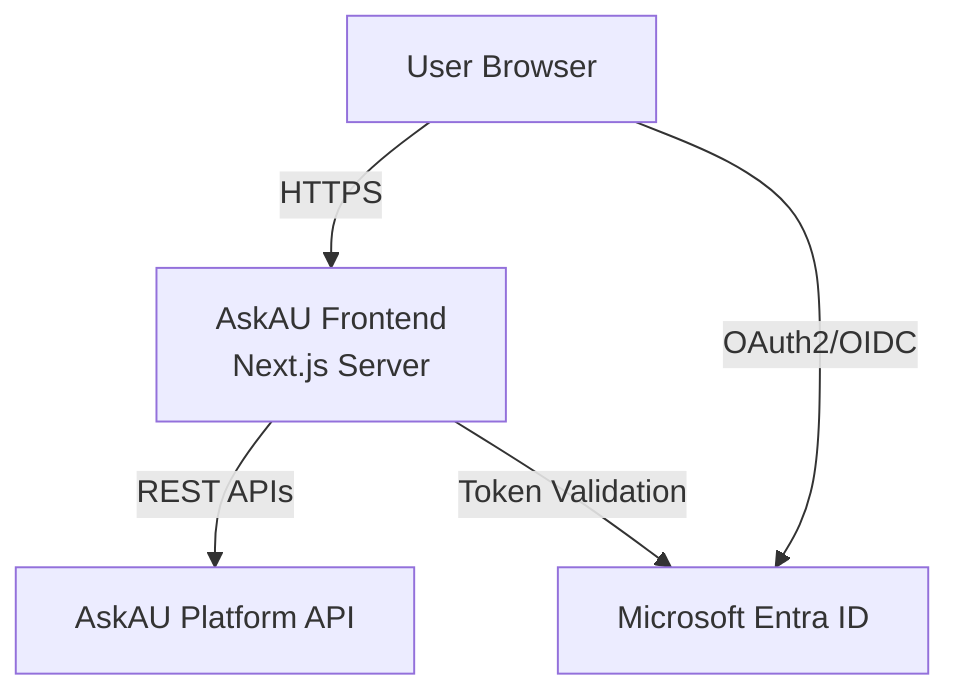

# Architecture Overview

AskAU is built as a modern, decoupled web application. The frontend acts purely as a UI and presentation layer, communicating with the AskAU Platform backend via secure REST APIs.

## Tech Stack

- **Core**: Next.js 15 (App Router), React 19, TypeScript
- **Styling**: Tailwind CSS v4, shadcn/ui, Radix UI
- **Data Fetching**: TanStack Query (React Query)
- **State Management**: React Context, URL Search Params, Zustand (if needed)
- **Internationalization**: `next-intl`
- **Authentication**: NextAuth.js (Auth.js)

## System Context

## Key Architectural Principles

1. **API-First Design**: The frontend contains no direct database access or heavy business logic. All data logic and complex aggregations reside in the backend.
2. **Server-Side Rendering (SSR)**: We leverage Next.js Server Components to render initial HTML on the server for better performance, SEO, and security.
3. **Feature-Oriented Architecture**: Code is grouped by business feature rather than technical concern, improving maintainability.
4. **Security by Default**: Secure headers, CSRF protection, and HttpOnly cookies are used. The backend remains the source of truth for authorization.
5. **Global Accessibility**: Support for multiple languages (including RTL Arabic) and WCAG 2.2 AA accessibility guidelines.